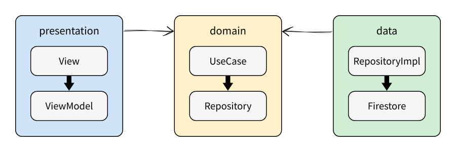

# 모멘토

  
  &nbsp;&nbsp;
  

## 🏝️ 여행을 기록하는 가장 감성적인 방법, 모멘토

- 자신의 여행 이야기를 간단하게 기록할 수 있어요
- 행복했던 순간들을 한눈에 모아 관리해보세요
- 원한다면 여행기록을 다른 사용자와 공유할 수도 있어요
- 공유된 여행은 새로운 여행지를 찾는 사람들에게 영감을 줍니다

 

## Android 앱 아키텍처 (MVVM + Clean Architecture)

